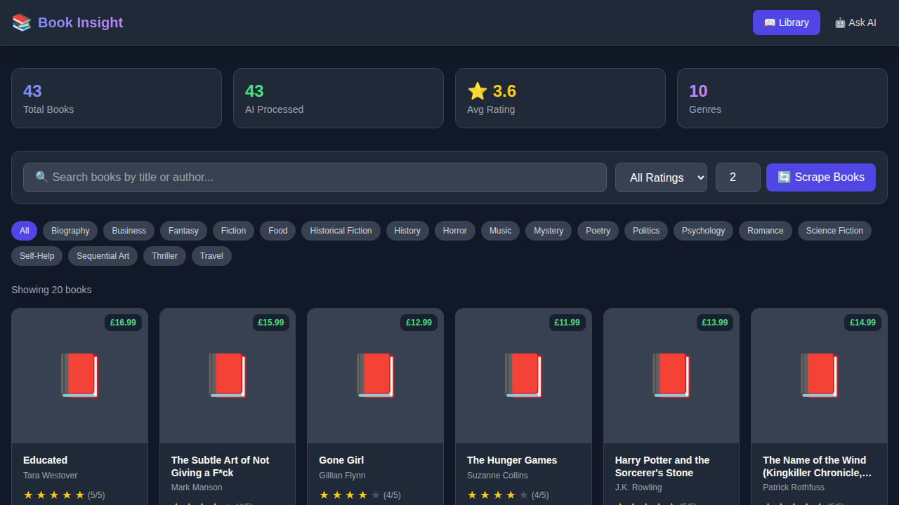
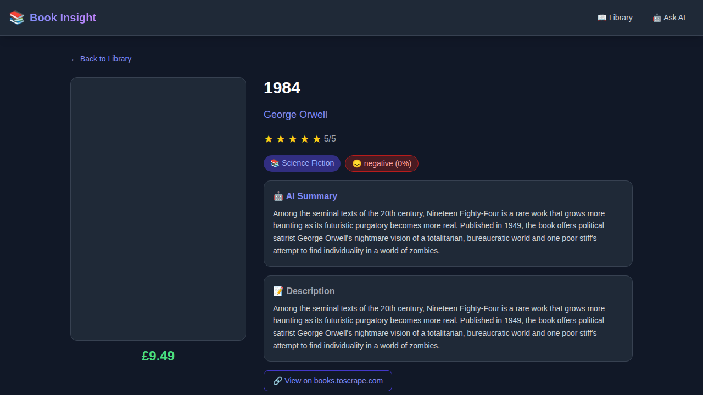
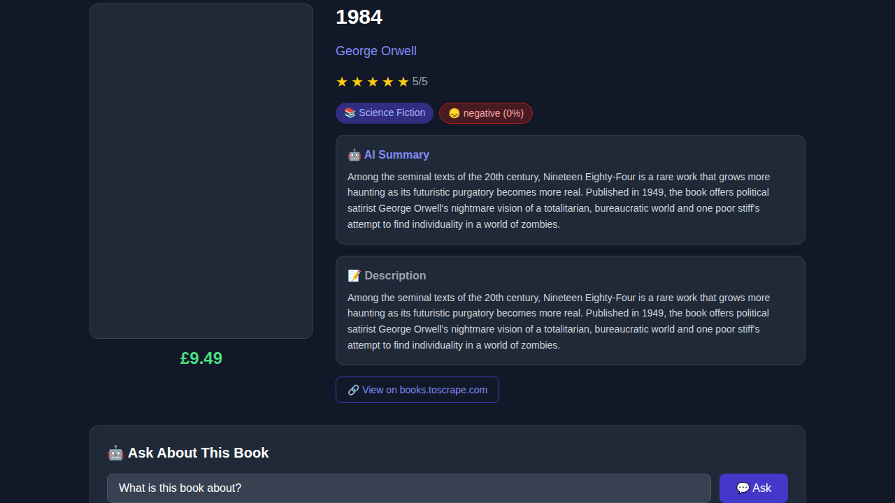
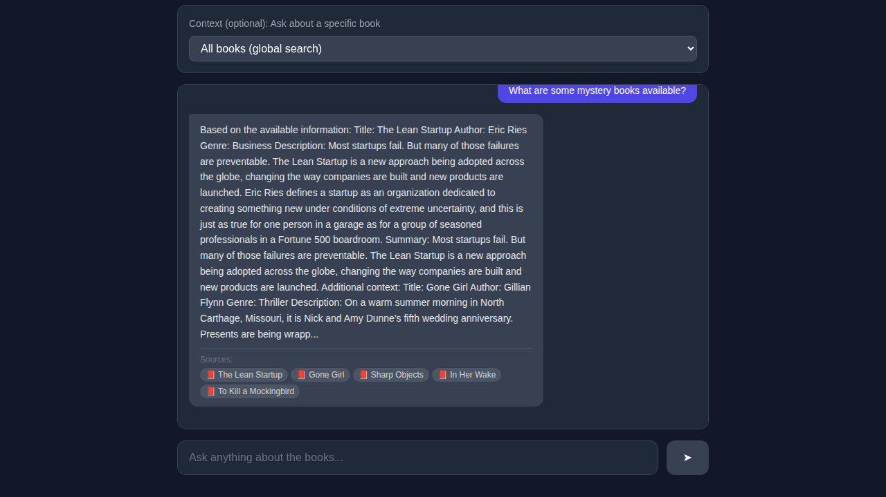

# 📚 Book Insight — Document Intelligence Platform

A full-stack web application with AI/RAG integration that processes book data and enables intelligent querying.

---

## 📸 Screenshots

### Dashboard / Book Library


### Book Detail Page


### Book Detail — Ask AI (RAG Q&A)


### Global Q&A Interface


---

## 🏗️ Architecture

```
book_insight/
├── backend/          # Django REST Framework API
│   ├── book_insight/ # Django project settings
│   ├── books/        # Core app: models, views, scraper, AI, RAG
│   ├── manage.py
│   └── requirements.txt
├── frontend/         # React + Tailwind CSS UI
│   ├── src/
│   │   ├── pages/    # Dashboard, BookDetail, QAInterface
│   │   ├── components/
│   │   └── api/
│   └── package.json
└── screenshots/      # UI screenshots
```

---

## 🚀 Setup Instructions

### Prerequisites
- Python 3.10+
- Node.js 18+
- pip

### Backend Setup

```bash
cd backend

# Install Python dependencies
pip install -r requirements.txt

# Apply database migrations
python manage.py migrate

# (Optional) Load sample books for testing
python manage.py load_sample_books

# Start the API server
python manage.py runserver
```

The backend runs at **http://localhost:8000**

### Frontend Setup

```bash
cd frontend

# Install Node.js dependencies
npm install

# Start the development server
npm start
```

The frontend runs at **http://localhost:3000**

### Quick Start

1. Start the backend (`python manage.py runserver` in `backend/`)
2. Start the frontend (`npm start` in `frontend/`)
3. Open http://localhost:3000
4. Click **"🔄 Scrape Books"** on the Dashboard to populate the library  
   *(If internet is unavailable, sample data is loaded automatically)*
5. Click any book to view details, AI insights, and ask questions
6. Use the **Ask AI** page for global Q&A across the entire library

---

## 📡 API Documentation

Base URL: `http://localhost:8000/api`

### GET `/books/`
List all books with optional filters.

**Query Parameters:**
| Param | Type | Description |
|-------|------|-------------|
| `search` | string | Search by title or author |
| `genre` | string | Filter by genre |
| `rating` | number | Minimum rating (1–5) |

**Response:**
```json
{
  "count": 43,
  "next": "http://localhost:8000/api/books/?page=2",
  "previous": null,
  "results": [
    {
      "id": 1,
      "title": "1984",
      "author": "George Orwell",
      "rating": 5.0,
      "genre": "Science Fiction",
      "sentiment": "negative",
      "cover_image_url": "...",
      "book_url": "..."
    }
  ]
}
```

### GET `/books/{id}/`
Get full details for a specific book, including AI-generated summary and sentiment.

**Response:**
```json
{
  "id": 1,
  "title": "1984",
  "author": "George Orwell",
  "rating": 5.0,
  "description": "...",
  "summary": "AI-generated summary...",
  "genre": "Science Fiction",
  "sentiment": "negative",
  "sentiment_score": 0.0,
  "is_processed": true
}
```

### GET `/books/{id}/recommendations/`
Get up to 5 books similar to the specified book (same genre, sorted by rating).

### POST `/books/scrape/`
Trigger book scraping. Falls back to built-in sample data if internet is unavailable.

**Request:**
```json
{ "pages": 2 }
```

**Response:**
```json
{
  "message": "Scraped 43 books",
  "created": 43,
  "updated": 0,
  "total": 43
}
```

### POST `/books/ask/`
Ask a question using the RAG pipeline.

**Request:**
```json
{
  "question": "What science fiction books do you have?",
  "book_id": 1  // optional: scope to a specific book
}
```

**Response:**
```json
{
  "question": "What science fiction books do you have?",
  "answer": "Based on the available information: ...",
  "sources": [
    { "book_id": "1", "title": "1984", "author": "George Orwell", "relevance": 0.85 }
  ],
  "context_used": ["...chunk text..."]
}
```

### GET `/books/genres/`
Returns a sorted list of all unique genres in the library.

### GET `/books/stats/`
Returns library statistics.

**Response:**
```json
{
  "total_books": 43,
  "processed_books": 43,
  "average_rating": 3.6,
  "genres": [{ "genre": "Science Fiction", "count": 5 }],
  "sentiments": [{ "sentiment": "positive", "count": 13 }]
}
```

---

## 🧠 AI Features

### 1. Summary Generation
Extracts the most informative sentences from a book's description. Falls back to a metadata-based summary if no description is available.

### 2. Genre Classification
Two-tier approach:
- **Scraped genre**: Normalizes the scraped category to a known genre label
- **Keyword-based ML**: Scores text against genre keyword dictionaries to predict genre when none is available

### 3. Sentiment Analysis
Keyword-based sentiment scoring that counts positive and negative indicator words in the description. Returns `positive`, `neutral`, or `negative` with a confidence score.

### 4. RAG Pipeline (Retrieval-Augmented Generation)
Complete RAG pipeline using:
- **Embeddings**: `HashingVectorizer` (512-dim, offline, no model download required)
- **Vector Store**: ChromaDB with persistent storage
- **Chunking**: Overlapping word windows (200 words, 30-word overlap)
- **Query**: Cosine similarity search over indexed chunks
- **Answer Generation**: Extractive answer from the most relevant context chunks with source citations

---

## 💾 Database Schema

### `books_book`
| Column | Type | Description |
|--------|------|-------------|
| id | Integer | Primary key |
| title | CharField(500) | Book title |
| author | CharField(300) | Author name |
| rating | FloatField | Rating 1–5 |
| num_reviews | IntegerField | Number of reviews |
| price | DecimalField | Price in £ |
| description | TextField | Full description |
| book_url | URLField | Link to source |
| cover_image_url | URLField | Cover image URL |
| genre | CharField(200) | Genre/category |
| summary | TextField | AI-generated summary |
| sentiment | CharField(50) | positive/neutral/negative |
| sentiment_score | FloatField | Confidence 0.0–1.0 |
| is_processed | BooleanField | Whether AI analysis is done |
| created_at | DateTimeField | Record creation time |
| updated_at | DateTimeField | Last update time |

---

## 🔧 Tech Stack

| Layer | Technology |
|-------|-----------|
| Backend | Django 4.2 + Django REST Framework |
| Database | SQLite (metadata) + ChromaDB (vectors) |
| Frontend | React 18 + Tailwind CSS |
| HTTP Client | Axios |
| Router | React Router DOM v7 |
| Embeddings | `HashingVectorizer` (sklearn, offline) |
| Scraping | requests + BeautifulSoup4 (+ Selenium optional) |
| AI Classification | Keyword-based + HashingVectorizer cosine similarity |

---

## 💬 Sample Q&A

| Question | Answer (excerpt) |
|----------|-----------------|
| "What are some science fiction books?" | "Based on the available information: Title: Dune, Author: Frank Herbert... *[source: Dune, The Hitchhiker's Guide]*" |
| "Tell me about mystery books" | "Based on the available information: Title: Sharp Objects, Author: Gillian Flynn... *[sources: Sharp Objects, Gone Girl, In Her Wake]*" |
| "What is 1984 about?" | "Based on the available information: Title: 1984, Author: George Orwell, Genre: Science Fiction, Description: Among the seminal texts of the 20th century..." |
| "Which books are good for self improvement?" | "Based on the available information: Title: Atomic Habits, Author: James Clear... *[sources: Atomic Habits, The Subtle Art...]*" |

---

## 🎁 Bonus Features

- ✅ **Offline support**: Falls back to 43 curated sample books when internet scraping fails
- ✅ **Smart chunking**: Overlapping word windows for better RAG context
- ✅ **Caching**: ChromaDB persistent storage avoids re-indexing
- ✅ **Source citations**: Every RAG answer includes relevance-ranked sources
- ✅ **Responsive design**: Mobile-friendly Tailwind CSS grid layout
- ✅ **Loading states**: Skeleton/spinner UI during API calls
- ✅ **Search & filter**: Real-time search, genre filter, rating filter
- ✅ **Error handling**: Graceful fallbacks throughout frontend and backend
- ✅ **Management command**: `python manage.py load_sample_books` for quick demo setup

---

## 📦 requirements.txt

```
django>=4.2
djangorestframework>=3.14
django-cors-headers>=4.0
requests>=2.31
beautifulsoup4>=4.12
sentence-transformers>=2.2
chromadb>=0.4
numpy>=1.24
scikit-learn>=1.3
python-dotenv>=1.0
pillow>=10.0
lxml>=4.9
```
